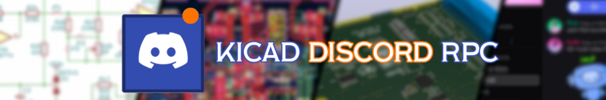

# KiCad Discord Rich Presence



KiCad Discord RPC is a lightweight windows application that automatically detects what you're currently doing in KiCad and displays it on your Discord profile through Discord Rich Presence. Whether you're working in the KiCad Manager, PCB Editor, or Schematic Editor, the application keeps your Discord activity updated in the background.


## Installation


Clone the Repository

```bash
  git clone <THIS_REPO_URL>
```

Install the required Python packages listed in `requirements.txt`

```bash
  pip install -r requirements.txt
```

For **development** and testing, you can run the application directly from the source code

```bash
  python src/main.py
```
The application should start and run in the background through the Windows system tray

### Build the Executable

If you want to create a standalone `.exe` file, you can build the application using `PyInstaller`

From the project root:
```bash
  mkdir release
  cd release
```

Run the following command:

```bash
  pyinstaller --clean --onefile --noconsole --name "KiCad-RPC" --icon "..\src\assets\kicad-rpc-icon.ico" --add-data "..\src\assets\kicad-rpc-icon.ico;assets" ..\src\main.py
```

You should see a folder name `dist` that have `KiCad-RPC.exe` in `release`

And for **users** you can download the setup file directly from [KiCad RPC setup](https://gorramin.itch.io/kicad-discord-rpc)
## Features

- Detects the active KiCad tool and shows it on Discord.
- Supports KiCad Manager, PCB Editor, and Schematic Editor.
- Clean and simple Discord Rich Presence.
- System tray icon with connection status and exit button.
- Lightweight and runs quietly in the background.


## Performance Tests

Not Yet


## Demo

Discord presence overview


Windows Tray overview


## FAQ

#### Why use Python instead of C++?

The original plan was to move from a standalone application to an installable KiCad plugin, since KiCad supports Python for plugin development. For that reason, the project was developed in Python.

#### How does it work?

The application communicates with the Discord client through Discord's IPC pipe. It does not use third-party libraries for Discord communication or KiCad activity detection. KiCad activity is detected using the Windows API, and the application sends the detected state to Discord through the IPC connection.

#### Is it safe?

Yes. The application does not communicate with the internet. It communicates locally with the Discord client through its IPC pipe and uses Windows APIs to detect KiCad activity. It does not perform privileged memory reading or writing.
## Support

Thank you for visiting! If you like this project, don't forget to give the repository a ⭐. And if you're feeling extra generous, you can [buy me a coffee](https://gorramin.itch.io/kicad-discord-rpc)


